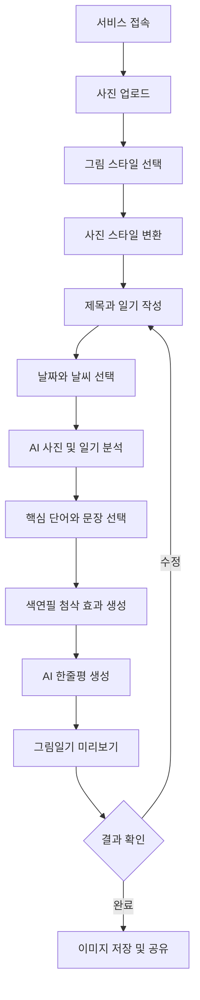
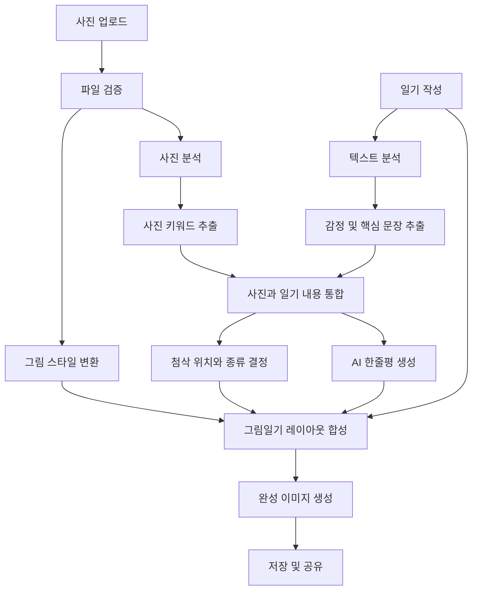
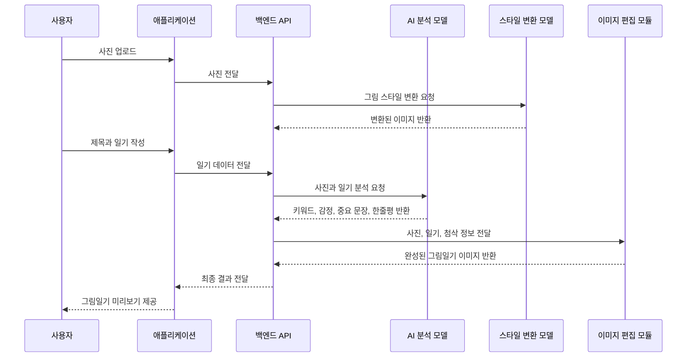

# 🌴 AI Weekly Picture Diary

> 사진 한 장과 짧은 글을  
> 한 편의 감성적인 여름 그림일기로 만들어주는 AI 기록 서비스

---

## 📌 프로젝트 소개

**AI Weekly Picture Diary**는 사용자가 업로드한 여름 사진과 직접 작성한 일기를 바탕으로, 하나의 그림일기 형태의 콘텐츠를 만들어주는 AI 기반 감성 기록 서비스입니다.

사용자가 사진과 일기를 등록하면 서비스는 다음 작업을 수행합니다.

- 원본 사진을 색연필 또는 크레파스 느낌의 그림으로 변환
- 일기 속 감정과 핵심 키워드 분석
- 중요한 단어나 문장에 동그라미, 밑줄, 별표 등의 첨삭 효과 추가
- 사진과 일기의 내용을 함께 반영한 AI 한줄평 생성
- 변환된 사진과 일기, 첨삭, 한줄평을 하나의 그림일기 이미지로 구성

이 서비스는 어린이만을 위한 그림일기 서비스가 아닙니다.

여행, 휴가, 일상, 데이트, 축제, 캠핑 등 여름에 경험한 순간을 기록하고 싶은 모든 연령층을 주요 사용자로 합니다.

단순히 사진을 보관하는 것을 넘어,

> **그날의 장면과 감정을 함께 기록하고 다시 꺼내 볼 수 있는 추억을 만드는 것**

을 목표로 합니다.

---

## 💡 기획 배경

사람들은 여행이나 특별한 순간을 사진으로 많이 남기지만, 시간이 지나면 그날 무엇을 느꼈는지 기억하기 어렵습니다.

기존 사진첩과 SNS는 사진을 저장하고 공유하는 데 초점이 맞춰져 있어, 사진 속 감정과 개인적인 이야기를 함께 기록하기에는 한계가 있습니다.

**AI Weekly Picture Diary**는 사진과 짧은 글을 그림일기라는 익숙한 형태로 재구성하여, 사용자가 부담 없이 자신의 하루와 감정을 기록할 수 있도록 합니다.

---

## 🎯 프로젝트 목표

### 사진, 글, 감정을 하나의 추억으로 만들기

사용자가 남긴 여름의 순간을 다음 요소로 재구성합니다.

- 사진을 바탕으로 변환된 그림
- 사용자가 직접 작성한 일기
- 일기에서 추출한 핵심 감정
- AI가 선택한 주요 단어와 문장
- 색연필 느낌의 첨삭 효과
- 사진과 글을 반영한 AI 한줄평

최종 결과물은 하나의 디지털 그림일기 이미지로 제공됩니다.

---

## 👥 주요 사용자

### 여행과 일상을 기록하고 싶은 사용자

- 여름휴가를 기록하고 싶은 사람
- 여행 사진에 짧은 이야기를 남기고 싶은 사람
- 평범한 일상을 감성적인 콘텐츠로 만들고 싶은 사람
- SNS에 올릴 색다른 콘텐츠를 만들고 싶은 사람
- 친구, 연인, 가족과의 추억을 기록하고 싶은 사람
- 글쓰기를 어렵게 느껴 짧은 문장으로 기록하고 싶은 사람

---

## 🌊 핵심 가치

### 1. 간단한 기록

사진 한 장과 짧은 글만으로 그림일기를 만들 수 있습니다.

### 2. 원본 추억 보존

사진을 완전히 새로 생성하는 것이 아니라, 원본 사진의 구도와 주요 대상을 유지한 채 그림 스타일로 변환합니다.

### 3. 감성적인 결과물

단순한 필터 적용을 넘어, 사진과 일기의 내용을 분석해 첨삭과 한줄평까지 제공합니다.

### 4. 공유 가능한 콘텐츠

완성된 그림일기를 이미지로 저장하거나 다른 사람과 공유할 수 있습니다.

---

# ☀️ 서비스 콘셉트

```text
사용자 사진 업로드
        ↓
그림 스타일 선택
        ↓
사진을 색연필 또는 크레파스 스타일로 변환
        ↓
사용자가 일기 작성
        ↓
AI가 감정과 핵심 키워드 분석
        ↓
중요한 단어와 문장 선택
        ↓
동그라미, 밑줄, 별표 등 첨삭 효과 추가
        ↓
AI 한줄평 생성
        ↓
그림, 일기, 첨삭, 한줄평을 하나의 이미지로 합성
        ↓
완성된 그림일기 저장 및 공유
```

---

# ✨ 핵심 기능

## 1. 사진 업로드

사용자는 자신의 기기에서 여름과 관련된 사진을 업로드합니다.

### 지원할 수 있는 사진 예시

- 바다
- 계곡
- 수영장
- 캠핑
- 여름휴가
- 축제
- 불꽃놀이
- 노을
- 카페
- 여행지
- 친구나 가족과 함께한 사진
- 평범한 여름 일상

### 업로드 조건 예시

- 지원 형식: JPG, JPEG, PNG, WEBP
- 최대 파일 크기: 10MB
- 사진은 한 번에 1장 업로드
- 지나치게 작은 이미지나 손상된 파일은 업로드 제한

---

## 2. 사진 스타일 변환

사용자가 업로드한 사진을 그림일기와 어울리는 스타일로 변환합니다.

### 지원 스타일

- 색연필
- 크레파스
- 수채화
- 스케치
- 어린 시절 그림일기풍

### 변환 원칙

- 원본 사진의 전체 구도 유지
- 사람과 사물의 위치 최대한 유지
- 배경과 주요 색상 유지
- 원본 인물을 다른 사람으로 변경하지 않음
- 새로운 사물이나 인물을 임의로 추가하지 않음
- 사진의 특징은 유지하면서 표현 방식만 그림처럼 변환

### 예시

```text
입력
📷 사용자가 직접 촬영한 바다 사진

출력
🎨 같은 구도와 장면을 유지한 색연필 스타일의 바다 그림
```

---

## 3. 일기 작성

사용자는 사진과 관련된 짧은 일기를 직접 작성합니다.

### 작성 예시

```text
오랜만에 친구들과 바다에 다녀왔다.
날씨가 맑아서 바다가 더 예뻐 보였다.
파도 소리를 들으며 쉬다 보니 마음이 편안해졌다.
```

### 작성 기능

- 제목 입력
- 일기 내용 입력
- 날짜 선택
- 날씨 선택
- 글자 수 안내
- 임시 저장
- 작성 내용 수정

### 권장 글자 수

```text
최소 20자
최대 500자
```

---

## 4. 사진 분석

AI는 업로드된 사진의 주요 요소를 분석합니다.

### 분석 항목

- 사진 속 장소
- 주요 사물
- 인물의 행동
- 전체적인 분위기
- 주요 색상
- 여름과 관련된 요소

### 분석 결과 예시

```text
장소: 바닷가
주요 요소: 바다, 모래사장, 맑은 하늘
분위기: 평온함, 시원함, 여유로움
계절 요소: 여름, 휴가, 바다 여행
```

사진 분석 결과는 내부 처리에 활용하며, 사용자가 원할 경우 간단한 태그 형태로 보여줄 수 있습니다.

---

## 5. 일기 분석

AI는 사용자가 작성한 일기의 내용을 분석합니다.

### 분석 항목

- 핵심 감정
- 주요 키워드
- 중요한 문장
- 글의 전체적인 분위기
- 사진과 일기의 연관성

### 입력 예시

```text
친구들과 바다에 다녀왔다.
오랜만에 수영해서 정말 즐거웠다.
해가 질 때까지 이야기를 나눴다.
```

### 분석 결과 예시

```text
핵심 감정: 즐거움, 편안함

주요 키워드:
- 친구
- 바다
- 수영
- 이야기

중요 문장:
- 오랜만에 수영해서 정말 즐거웠다.
```

---

## 6. AI 첨삭 효과

AI는 일기에서 의미 있는 단어나 문장을 선택하고, 실제 색연필로 표시한 것 같은 첨삭 효과를 추가합니다.

### 지원 효과

- 동그라미
- 밑줄
- 이중 밑줄
- 체크 표시
- 별표
- 물결 밑줄
- 화살표
- 작은 낙서

### 적용 예시

```text
⭕ 친구들
⭕ 바다

오랜만에 수영해서 정말 즐거웠다.
──────────────────────

☆ 좋은 추억
```

### 첨삭 원칙

- 첨삭 표시를 지나치게 많이 사용하지 않음
- 핵심 단어 2~4개만 선택
- 중요 문장 1개 정도만 강조
- 사용자의 글을 평가하거나 지적하는 느낌보다 감상하고 공감하는 느낌을 유지
- 맞춤법 교정보다는 감정과 이야기의 핵심을 강조

---

## 7. AI 한줄평 생성

AI는 사진과 일기를 함께 분석해 공백 포함 50자 이내의 한줄평을 생성합니다. 미리보기와 저장 이미지에서는 최대 2줄로 표시하며, 표시 영역을 초과할 경우 마지막 줄에 말줄임표를 사용합니다.

### 생성 기준

- 사진 속 장면 반영
- 일기 속 핵심 감정 반영
- 부드럽고 긍정적인 표현 사용
- 지나치게 어린아이에게 말하는 듯한 문체는 피함
- 모든 연령층이 자연스럽게 받아들일 수 있는 문장 사용

### 한줄평 예시

```text
시원한 바다와 함께한 여유로운 하루가 글에 잘 담겨 있네요.
```

```text
친구들과 보낸 즐거운 여름의 순간이 오래 기억에 남을 것 같아요.
```

```text
파도 소리와 편안했던 마음이 함께 전해지는 기록이에요.
```

### 피드백 스타일 선택 기능

사용자가 원하는 한줄평 분위기를 선택할 수 있습니다.

- 따뜻한 선생님
- 친한 친구
- 감성 작가
- 담백한 기록
- 유쾌한 피드백

---

## 8. 그림일기 레이아웃 생성

변환된 사진과 일기 내용을 하나의 그림일기 형태로 배치합니다.

### 기본 구성

```text
┌─────────────────────────────┐
│ 날짜               날씨      │
├─────────────────────────────┤
│                             │
│       변환된 사진 영역       │
│                             │
├─────────────────────────────┤
│ 제목                        │
├─────────────────────────────┤
│ 일기 내용                    │
│ 동그라미, 밑줄 등 첨삭 표시   │
├─────────────────────────────┤
│ AI 한줄평                    │
└─────────────────────────────┘
```

### 레이아웃 스타일

- 기본 그림일기
- 빈티지 노트
- 여름 엽서
- 학교 공책
- 감성 다이어리

MVP에서는 기본 그림일기 레이아웃 한 가지를 우선 제공합니다.

---

## 9. 결과 저장 및 공유

완성된 그림일기는 이미지 파일로 저장할 수 있습니다.

### 제공 기능

- PNG 이미지 저장
- JPG 이미지 저장
- 기기 내 저장
- 공유 링크 생성
- SNS 공유
- 그림일기 삭제
- 다시 편집하기

---

# 🌴 여름 특화 기능

AI는 사진과 글에서 여름과 관련된 요소를 분석합니다.

## 인식 가능한 여름 요소

- 바다
- 계곡
- 수영장
- 워터파크
- 캠핑
- 수박
- 빙수
- 축제
- 불꽃놀이
- 노을
- 여행
- 장마
- 우산
- 휴가
- 피서
- 야시장
- 여름밤

---

## 🏷 감성 태그 생성

AI가 사진과 일기 내용을 바탕으로 태그를 자동으로 생성합니다.

### 예시

```text
#여름
#바다
#친구
#여행
#휴식
#여유
#좋은추억
```

사용자는 생성된 태그를 수정하거나 삭제할 수 있습니다.

---

# 📅 주간 그림일기

사용자가 한 주 동안 작성한 그림일기를 모아 주간 기록으로 제공합니다.

### 제공 정보

- 일주일 동안 작성한 그림일기
- 가장 자주 등장한 장소
- 가장 자주 등장한 단어
- 기록에 많이 나타난 감정
- 이번 주를 대표하는 사진
- AI가 작성한 주간 한줄평

### 예시

```text
이번 주에는 바다와 여행에 관한 기록이 많았어요.

자주 등장한 단어:
1. 바다
2. 친구
3. 여행

대표 감정:
- 즐거움
- 편안함
- 설렘

AI 주간 한줄평:
여름의 시원함과 사람들과 함께한 즐거움이 가득한 한 주였어요.
```

감정을 점수로 단정하기보다는, 기록에서 자주 나타난 감정을 요약하는 방식으로 제공합니다.

---

# 🧭 사용자 이용 흐름



---

# 🏗 시스템 구조



---

# 📱 서비스 처리 흐름



---

# 🧠 기술 구성

> 아래 기술은 프로젝트 규모와 배포 환경에 따라 변경될 수 있습니다.

## Front-End

웹 서비스로 먼저 개발할 경우:

- React
- Next.js
- TypeScript
- Tailwind CSS

모바일 앱으로 개발할 경우:

- Flutter
- Dart

MVP 단계에서는 개발 범위를 줄이기 위해 웹 또는 모바일 중 하나만 선택하는 것이 좋습니다.

### 권장 MVP 구성

```text
Front-End: React 또는 Streamlit
Back-End: FastAPI
Language: Python
```

빠른 프로토타입이 목표라면 Streamlit을 사용하고, 실제 서비스 형태를 목표로 한다면 React와 FastAPI 조합을 권장합니다.

---

## Back-End

- Python
- FastAPI
- Pydantic
- Uvicorn

### 주요 역할

- 사용자 요청 처리
- 이미지 파일 검증
- AI 모델 호출
- 사진 및 일기 분석
- 최종 이미지 생성
- 결과 파일 저장
- 사용자 기록 관리

---

## AI 분석

- 이미지 이해가 가능한 멀티모달 모델
- 텍스트 분석이 가능한 LLM
- 프롬프트 기반 키워드 및 감정 추출
- 사진과 일기를 함께 반영한 한줄평 생성

### AI 반환 데이터 예시

```json
{
  "photo_keywords": [
    "바다",
    "모래사장",
    "맑은 하늘"
  ],
  "diary_keywords": [
    "친구",
    "여행",
    "휴식"
  ],
  "emotions": [
    "즐거움",
    "편안함"
  ],
  "highlight_words": [
    "바다",
    "오랜만에",
    "마음이 편안해졌다"
  ],
  "comment": "시원한 바다와 함께한 여유로운 하루가 글에 잘 담겨 있네요."
}
```

---

## 사진 스타일 변환

- Stable Diffusion Img2Img
- ControlNet
- IP-Adapter
- 스타일 변환 API
- 이미지 필터 기반 변환

### 기술 선택 기준

- 원본 사진의 구도 유지 여부
- 인물과 사물의 형태 보존 여부
- 처리 속도
- 서버 비용
- 상업적 이용 가능 여부
- 결과물의 일관성

MVP에서는 복잡한 생성 모델을 직접 운영하기보다, 이미지 필터 또는 외부 스타일 변환 API를 먼저 사용할 수 있습니다.

---

## 이미지 편집

- Pillow
- OpenCV

### 주요 역할

- 그림일기 템플릿 생성
- 변환된 이미지 배치
- 일기 텍스트 삽입
- 동그라미와 밑줄 렌더링
- 색연필 효과 적용
- 한줄평 삽입
- 최종 이미지 저장

첨삭 효과는 생성형 AI에 맡기기보다 좌표 기반으로 직접 그리는 것이 결과를 안정적으로 제어하기 좋습니다.

---

## OCR

사용자가 직접 일기를 입력하는 방식이라면 OCR은 MVP에 필수적이지 않습니다.

다만 사용자가 손으로 쓴 일기 사진을 업로드하는 기능을 추가한다면 다음 기술을 활용할 수 있습니다.

- PaddleOCR
- EasyOCR
- Google Cloud Vision OCR
- 네이버 CLOVA OCR

### OCR 활용 예시

```text
손글씨 그림일기 사진 업로드
        ↓
OCR로 글자 추출
        ↓
사용자가 추출된 글자 확인 및 수정
        ↓
AI 분석
```

OCR은 향후 확장 기능으로 분리하는 것이 적절합니다.

---

## 데이터베이스

- SQLite: 초기 개발 및 테스트
- PostgreSQL: 실제 배포 및 사용자 데이터 관리

### 저장 데이터

- 사용자 정보
- 그림일기 제목
- 작성 날짜
- 날씨
- 원본 사진 경로
- 변환 사진 경로
- 일기 내용
- 분석된 키워드
- 감정 정보
- AI 한줄평
- 완성 이미지 경로
- 생성 날짜

---

## 파일 저장소

- 로컬 저장소: 개발 단계
- AWS S3
- Google Cloud Storage
- Supabase Storage

사용자가 업로드한 사진과 완성된 그림일기는 파일 저장소에 보관합니다.

---

# 📂 프로젝트 구조 예시

```text
AI_weekly_picture_diary/

├── frontend/
│   ├── src/
│   │   ├── components/
│   │   ├── pages/
│   │   ├── services/
│   │   └── assets/
│   └── package.json
│
├── backend/
│   ├── main.py
│   │
│   ├── api/
│   │   ├── diary.py
│   │   ├── image.py
│   │   └── user.py
│   │
│   ├── services/
│   │   ├── image_analysis.py
│   │   ├── style_transfer.py
│   │   ├── diary_analysis.py
│   │   ├── feedback_generator.py
│   │   └── diary_renderer.py
│   │
│   ├── schemas/
│   │   ├── diary.py
│   │   └── analysis.py
│   │
│   ├── prompts/
│   │   ├── diary_analysis.txt
│   │   ├── highlight_selection.txt
│   │   └── feedback_generation.txt
│   │
│   ├── templates/
│   │   └── basic_diary_template.png
│   │
│   ├── static/
│   │   ├── uploads/
│   │   ├── converted/
│   │   └── outputs/
│   │
│   └── requirements.txt
│
├── tests/
│
├── .env.example
├── .gitignore
└── README.md
```

---

# 🔌 API 구성 예시

## 사진 업로드

```http
POST /api/images/upload
```

## 사진 스타일 변환

```http
POST /api/images/convert
```

## 일기 분석

```http
POST /api/diaries/analyze
```

## 그림일기 생성

```http
POST /api/diaries/generate
```

## 그림일기 조회

```http
GET /api/diaries/{diary_id}
```

## 그림일기 삭제

```http
DELETE /api/diaries/{diary_id}
```

---

# ✅ MVP 범위

첫 번째 버전에서는 핵심 경험을 검증하는 데 집중합니다.

## MVP 필수 기능

- 사진 1장 업로드
- 제목과 일기 작성
- 색연필 스타일 1종 제공
- 사진과 일기 키워드 분석
- 중요한 단어 2~4개 선택
- 밑줄 또는 동그라미 첨삭
- AI 한줄평 생성
- 하나의 기본 그림일기 템플릿 제공
- 결과 이미지 저장

## MVP에서 제외할 기능

- 회원가입
- 친구 기능
- 여러 장의 사진 업로드
- 다양한 그림 스타일
- 주간 감정 리포트
- PDF 앨범 제작
- 손글씨 OCR
- SNS 자동 업로드
- 유료 결제

MVP 이후 사용자 반응에 따라 기능을 단계적으로 추가합니다.

---

# 🗓️ 개발 단계

## 1단계: 화면 및 기본 입력

- 사진 업로드 화면
- 일기 작성 화면
- 날짜와 날씨 선택
- 미리보기 화면

## 2단계: AI 분석

- 사진 키워드 추출
- 일기 감정 분석
- 핵심 단어와 문장 선택
- 한줄평 생성

## 3단계: 스타일 변환

- 사진을 색연필 스타일로 변환
- 원본과 결과 비교
- 변환 실패 예외 처리

## 4단계: 그림일기 합성

- 템플릿 제작
- 사진과 일기 배치
- 첨삭 표시 추가
- 한줄평 삽입
- 최종 이미지 저장

## 5단계: 테스트 및 배포

- 다양한 사진 테스트
- 긴 일기와 짧은 일기 테스트
- 모바일 화면 테스트
- 처리 속도 개선
- 배포 환경 구성

---

# 🚨 예외 처리

## 사진 관련

- 사진이 업로드되지 않은 경우
- 지원하지 않는 파일 형식인 경우
- 사진 용량이 너무 큰 경우
- 이미지 변환에 실패한 경우
- 사진이 지나치게 흐리거나 어두운 경우

## 일기 관련

- 일기가 비어 있는 경우
- 입력 글자 수가 너무 짧은 경우
- 입력 글자 수가 제한을 초과한 경우
- 분석 가능한 내용이 부족한 경우

## AI 관련

- AI 응답 시간이 초과된 경우
- 분석 결과가 올바른 형식이 아닌 경우
- 한줄평 생성에 실패한 경우
- 부적절한 응답이 생성된 경우

### 실패 시 처리 예시

```text
사진을 그림 스타일로 변환하지 못했습니다.
원본 사진으로 그림일기를 만들거나 다시 시도할 수 있습니다.
```

---

# 🔒 개인정보 및 안전

사용자 사진에는 얼굴, 위치, 주변 환경 등 개인 정보가 포함될 수 있으므로 안전한 처리가 필요합니다.

## 기본 원칙

- 사용자의 동의 없이 사진을 외부에 공개하지 않음
- 사용자가 삭제한 사진은 저장소에서도 삭제
- 업로드한 사진을 AI 학습에 사용하지 않음
- 원본 사진과 완성 이미지의 보관 기간 안내
- 공유 기능은 사용자가 직접 선택한 경우에만 활성화
- 사진 접근 권한과 저장 권한을 명확하게 안내

## 콘텐츠 안전

- 부적절하거나 불법적인 이미지 업로드 방지
- 혐오, 폭력, 노골적인 콘텐츠 필터링
- 개인정보가 포함된 일기 공유 전 경고 표시
- 타인의 얼굴이 포함된 사진 공유 시 주의 안내

---

# 🌟 서비스 차별점

## 일반 사진 필터 서비스와의 차이

일반 사진 필터는 사진의 스타일만 바꾸지만, 이 서비스는 사진과 글을 함께 분석합니다.

```text
사진 스타일 변환
+
일기 감정 분석
+
핵심 문장 첨삭
+
AI 한줄평
+
그림일기 레이아웃
```

## 일반 일기 서비스와의 차이

텍스트만 저장하는 것이 아니라, 사용자의 실제 사진을 그림으로 변환해 시각적인 기록으로 제공합니다.

## SNS와의 차이

다른 사람의 반응을 얻는 것이 목적이 아니라, 개인의 감정과 추억을 기록하고 보관하는 것이 중심입니다.

---

# 📊 성공 지표

서비스를 출시한 뒤 다음 항목을 확인할 수 있습니다.

- 그림일기 생성 완료율
- 사진 업로드 후 결과 생성까지의 이탈률
- 사용자의 평균 일기 작성 길이
- 결과 이미지 저장 비율
- 결과 이미지 공유 비율
- 일주일 내 재방문율
- 스타일 변환 재시도 횟수
- AI 한줄평 만족도
- 평균 결과 생성 시간

### 초기 목표 예시

```text
그림일기 생성 완료율: 70% 이상
결과 이미지 저장 비율: 50% 이상
평균 생성 시간: 30초 이내
일주일 내 재방문율: 20% 이상
```

---

# 🌊 기대 효과

## 1. 부담 없는 감성 기록

긴 글을 작성하지 않아도 사진과 짧은 문장만으로 하루를 기록할 수 있습니다.

## 2. 추억 보관

사진만 저장했을 때 잊기 쉬운 당시의 감정과 이야기를 함께 남길 수 있습니다.

## 3. 공유 가능한 개인 콘텐츠

사용자가 직접 촬영한 사진을 바탕으로 세상에 하나뿐인 그림일기를 만들 수 있습니다.

## 4. 멀티모달 AI 활용

- 이미지 이해
- 텍스트 이해
- 감정 및 키워드 분석
- 사진 스타일 변환
- 이미지 합성

등의 기술을 하나의 사용자 경험으로 연결할 수 있습니다.

## 5. 프로젝트 포트폴리오 활용

단순한 AI 챗봇이 아니라 입력, 분석, 이미지 처리, 결과물 생성까지 포함한 완성형 AI 서비스 프로젝트로 활용할 수 있습니다.

---

# 🚀 향후 확장 기능

## 1. 다양한 계절 지원

```text
봄: 벚꽃 그림일기
여름: 휴가 그림일기
가을: 단풍 그림일기
겨울: 연말 그림일기
```

---

## 2. 주간 및 월간 기록

- 주간 그림일기 모음
- 월간 대표 사진
- 자주 사용한 단어
- 자주 기록한 감정
- AI 월간 한줄평

---

## 3. PDF 그림일기 책 제작

사용자가 작성한 그림일기를 모아 PDF 또는 인쇄 가능한 앨범 형태로 제공합니다.

```text
나의 2026년 여름 그림일기
```

---

## 4. 함께 쓰는 그림일기

친구, 가족, 연인과 하나의 그림일기 앨범을 함께 작성합니다.

```text
우리의 2026년 여름
```

---

## 5. AI 추억 회상

과거에 작성한 그림일기를 바탕으로 추억을 다시 보여줍니다.

```text
작년 이맘때에는 부산 바다에서 여름휴가를 보냈어요.
그날의 기록을 다시 확인해보세요. 🌊
```

---

## 6. 손글씨 일기 인식

종이에 직접 작성한 그림일기를 촬영하면 OCR을 통해 글자를 인식하고 디지털 그림일기로 저장합니다.

---

## 7. 음성 일기

사용자가 일기를 말하면 음성을 텍스트로 변환하여 그림일기를 생성합니다.

```text
사진 업로드
        ↓
음성으로 하루 설명
        ↓
텍스트 일기 자동 작성
        ↓
사용자 확인 및 수정
```

---

## 8. 배경음악이 포함된 영상

그림일기 이미지와 짧은 배경음악을 결합해 SNS용 영상으로 제작합니다.

---

# 🎨 최종 슬로건

> **사진 한 장과 짧은 글이, 한 편의 여름 추억이 됩니다.**

### 추가 슬로건 후보

> 여름의 순간을 그림일기로 남기다.

> 당신의 여름을 AI가 따뜻하게 기록합니다.

> 사진에 감정을 더해, 오래 남는 추억으로.

> 오늘의 여름을 한 장의 그림일기로.