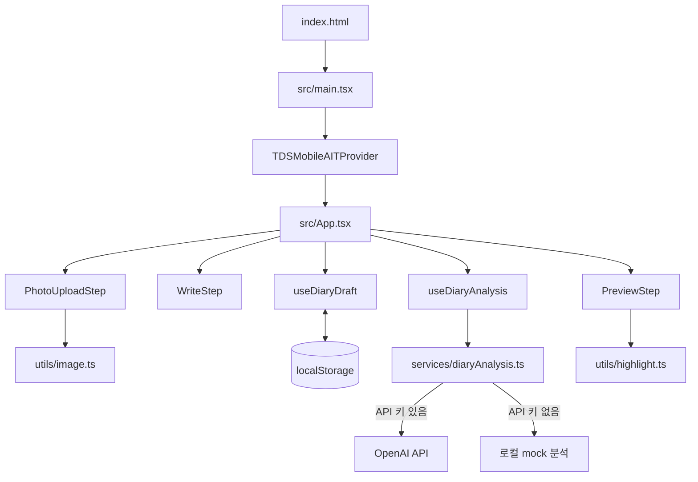

# Toss Summer App 코드 구조 설명

## 1. 프로젝트 개요

이 저장소의 실제 실행 앱은 `summer-vacation-diary/`에 있는 **여름방학 그림일기 미니앱**이다. React와 TypeScript로 작성되었고, Vite를 Apps in Toss의 Granite 개발·배포 도구로 감싸서 실행한다. 화면 구성에는 Toss Design System Mobile(TDS Mobile)을 사용한다.

현재 앱에서 동작하는 범위는 다음과 같다.

1. 기기에서 여름 사진 1장을 선택한다.
2. 제목, 날짜, 날씨, 일기 내용을 작성한다.
3. 사진과 일기를 AI 또는 로컬 체험 모드로 분석한다.
4. 핵심 단어·문장 첨삭 표시, 감성 태그, 선생님 한줄평이 포함된 그림일기 카드를 미리 본다.
5. 작성 중인 내용은 브라우저 `localStorage`에 임시 저장된다.

기획 문서에 있는 **사진의 그림 스타일 변환, 최종 이미지 합성·다운로드, 공유, 주간 일기, 감정 리포트, 백엔드 저장**은 아직 구현되지 않았다. 따라서 현재 화면의 `완성하기` 버튼은 결과물을 생성하지 않고, 미구현 안내 후 새 일기 시작 여부만 확인한다.

> 코드에서 말하는 `upload → write → preview`의 3단계 **화면 단계**와 기획 문서의 “3단계: 스타일 변환”이라는 **개발 단계**는 서로 다른 개념이다.

## 2. 사용 기술

| 구분 | 기술 | 역할 |
| --- | --- | --- |
| UI | React 18, React DOM | 컴포넌트 기반 화면 구성 |
| 언어 | TypeScript 5.7 | 타입 검사와 안전한 데이터 모델 정의 |
| 디자인 시스템 | `@toss/tds-mobile`, `@toss/tds-colors`, `@toss/tds-mobile-ait` | Toss 스타일의 입력창, 버튼, 다이얼로그, 토스트와 색상 제공 |
| 개발·번들링 | Vite 6, Granite, Apps in Toss Web Framework | 로컬 개발 서버, 빌드, 앱인토스 배포 |
| AI 분석 | OpenAI Chat Completions API 또는 로컬 mock | 사진·일기 키워드, 감정, 첨삭 대상, 한줄평 생성 |
| 저장 | 브라우저 `localStorage` | 작성 중인 일기 임시 저장 |
| 품질 도구 | ESLint, Prettier | 정적 검사와 코드 포맷팅 |

별도의 라우터, 서버, 데이터베이스, 전역 상태 관리 라이브러리, 테스트 프레임워크는 현재 없다.

## 3. 전체 디렉터리 구조

아래 구조는 Git 내부 파일, 설치 의존성인 `node_modules/`, 빌드 결과인 `dist/`를 제외한 것이다.

```text
Toss_Summer_app/
├─ README.md
├─ AI_weekly_picture_diary_1.md
├─ AI_weekly_picture_diary_2.md
├─ explain.md
└─ summer-vacation-diary/
   ├─ .granite/
   │  └─ app.json
   ├─ docs/
   │  └─ skills/
   │     ├─ apps-in-toss.md
   │     └─ tds-mobile.md
   ├─ public/
   │  └─ appsintoss-logo.png
   ├─ src/
   │  ├─ components/
   │  │  ├─ PhotoUploadStep.tsx
   │  │  ├─ WriteStep.tsx
   │  │  └─ PreviewStep.tsx
   │  ├─ constants/
   │  │  └─ diary.ts
   │  ├─ hooks/
   │  │  ├─ useDiaryDraft.ts
   │  │  └─ useDiaryAnalysis.ts
   │  ├─ services/
   │  │  └─ diaryAnalysis.ts
   │  ├─ utils/
   │  │  ├─ image.ts
   │  │  └─ highlight.ts
   │  ├─ App.css
   │  ├─ App.tsx
   │  ├─ index.css
   │  ├─ main.tsx
   │  └─ vite-env.d.ts
   ├─ .gitignore
   ├─ CLAUDE.md
   ├─ README.md
   ├─ eslint.config.js
   ├─ granite.config.ts
   ├─ index.html
   ├─ package-lock.json
   ├─ package.json
   ├─ tsconfig.app.json
   ├─ tsconfig.json
   ├─ tsconfig.node.json
   └─ vite.config.ts
```

## 4. 실행 구조와 데이터 흐름



### 4.1 앱 시작

`index.html`의 `#root` 요소에 `main.tsx`가 React 앱을 마운트한다. `main.tsx`는 앱 전체를 `TDSMobileAITProvider`로 감싸 토스트, 다이얼로그와 TDS 테마가 동작하도록 하며, 브랜드 대표 색상은 `granite.config.ts`에서 가져온다.

### 4.2 화면 단계 전환

`App.tsx`가 라우터 없이 `step` 상태 하나로 세 화면을 전환한다.

```text
upload ── 사진 선택 완료 ──> write ── 유효한 일기 입력 ──> preview
  ^                            ^                                  │
  └──────── 이전 ─────────────┘──────────── 수정하기 ────────────┘
```

- `upload`: 사진이 있어야 `일기 쓰러 가기` 버튼이 활성화된다.
- `write`: 공백을 제외한 제목이 있고, 공백을 제외한 본문이 20자 이상이어야 미리보기로 갈 수 있다.
- `preview`: 분석을 실행하고 결과를 카드에 표시한다. 수정 화면으로 돌아가도 입력이 바뀌지 않았다면 분석 결과를 재사용한다.
- `완성하기`: 아직 없는 스타일 변환·결과 생성 기능을 안내한 뒤, 확인 시 초안을 지우고 첫 화면으로 돌아간다.

### 4.3 초안 저장 흐름

모든 입력값은 `DiaryDraft` 한 객체에 모인다.

```ts
interface DiaryDraft {
  photoDataUrl: string | null;
  title: string;
  content: string;
  date: string;
  weather: WeatherValue;
}
```

`useDiaryDraft`가 이 객체를 React 상태로 관리하고 `summer-vacation-diary:draft:v2` 키로 `localStorage`에 보관한다. 일반 변경은 400ms 디바운스 후 저장하고, 페이지가 숨겨지거나 종료될 때는 즉시 저장을 시도한다. 저장 데이터가 손상되었거나 필드 형식이 잘못되면 안전한 기본값으로 복구한다.

사진도 Base64 데이터 URL 형태로 초안 안에 들어간다. 저장 용량을 줄이기 위해 업로드 직후 최대 1280px, JPEG 품질 0.85로 축소·재인코딩한다.

### 4.4 분석 흐름

미리보기 화면이 활성화되면 `useDiaryAnalysis`가 사진, 제목, 본문, 날씨를 묶어 입력 서명을 만들고 `analyzeDiary`를 호출한다. 날짜는 AI 입력에 사용하지 않으므로 서명에서 제외된다.

- 동일 입력의 진행 중 요청을 재사용해 중복 API 호출을 막는다.
- 최근 성공 결과 3개를 메모리에 캐시한다.
- 사용자가 내용을 바꾼 뒤 이전 요청이 늦게 끝나도 오래된 결과가 화면을 덮지 못하게 요청 ID를 검사한다.
- 실패하면 사용자용 오류 메시지와 `다시 시도` 버튼을 표시한다.

`diaryAnalysis.ts`는 환경 변수에 따라 분석 공급자를 고른다.

- `VITE_OPENAI_API_KEY`가 있으면 사진과 일기를 OpenAI Chat Completions API로 전송한다.
- 키가 없으면 1.2초 지연을 둔 결정적 로컬 mock 결과를 만들어 체험 모드로 동작한다.

실제 AI 응답은 JSON으로 받아 키워드 배열, 감정 배열, 첨삭 단어, 첨삭 문장, 한줄평을 검사한다. 본문에 실제로 존재하지 않는 첨삭 단어나 문장은 버려 잘못된 위치가 표시되지 않게 한다.

### 4.5 미리보기 표시

`PreviewStep`은 날짜·날씨, 사진, 제목, 본문, 한줄평 순서로 종이 일기장 형태의 카드를 그린다. 분석된 감정과 사진·일기 키워드는 중복을 제거한 뒤 최대 6개 태그로 표시한다.

`buildHighlightSegments`는 본문을 일반 텍스트, 동그라미 단어, 물결 밑줄 문장 조각으로 나눈다. 문장 범위를 먼저 확보하고 단어 범위가 겹치지 않게 처리하며, `dangerouslySetInnerHTML` 없이 React 텍스트로 출력해 사용자 입력에 의한 HTML 주입을 피한다.

## 5. 폴더별 역할

| 폴더 | 역할 |
| --- | --- |
| 저장소 루트 | 프로젝트 소개와 제품 기획 문서를 보관하고 실제 앱 폴더를 포함한다. |
| `summer-vacation-diary/` | 실행 가능한 프론트엔드 앱의 루트. 빌드·배포·타입 검사 설정이 모여 있다. |
| `.granite/` | Granite가 읽는 최소 앱 메타데이터를 보관한다. |
| `docs/skills/` | Apps in Toss와 TDS Mobile 개발 시 참고하는 로컬 문서 모음이다. 런타임 번들에는 들어가지 않는다. |
| `public/` | Vite가 가공하지 않고 정적 파일로 복사하는 공개 에셋 폴더다. |
| `src/` | 실제 React 애플리케이션 소스가 위치한다. |
| `src/components/` | 각 화면 단계와 화면 전용 표현 로직을 담당한다. |
| `src/constants/` | 여러 모듈이 공유하는 일기 도메인 규칙과 제한값을 정의한다. |
| `src/hooks/` | 초안과 AI 분석 같은 상태·비동기 생명주기 로직을 UI에서 분리한다. |
| `src/services/` | 외부 AI 서비스 또는 로컬 mock과 통신하는 경계 계층이다. |
| `src/utils/` | 이미지 처리와 텍스트 구간 분할처럼 UI와 독립적인 보조 로직을 담는다. |

`node_modules/`는 `npm install`로 생성되는 의존성 폴더이고, `dist/`는 `npm run build`로 생성되는 결과 폴더다. 둘 다 `.gitignore` 대상이며 소스 구조에는 포함하지 않는다.

## 6. 파일별 기능

### 6.1 저장소 루트

| 파일 | 기능 |
| --- | --- |
| `README.md` | 저장소 이름과 챌린지용 Apps in Toss 앱이라는 간단한 소개를 담는다. |
| `AI_weekly_picture_diary_1.md` | AI 그림일기의 초기 아이디어, 기능, 시스템 구조, 기술 후보, 확장 방향을 정리한 1차 기획서다. |
| `AI_weekly_picture_diary_2.md` | 업로드 조건, 분석 반환값, 예외 처리, MVP 범위와 개발 단계까지 구체화한 상세 기획서다. 현재 코드의 글자 수·파일 형식·AI 응답 규칙 다수가 이 문서를 기준으로 한다. |
| `explain.md` | 현재 실제 코드의 구조와 파일 역할, 데이터 흐름, 구현 범위를 설명하는 이 문서다. |

### 6.2 `summer-vacation-diary/` 설정 파일

| 파일 | 기능 |
| --- | --- |
| `.gitignore` | 의존성, 빌드 결과, `.env` 비밀값, OS 임시 파일이 Git에 포함되지 않게 한다. |
| `README.md` | 개발·빌드·배포 명령과 OpenAI 환경 변수 설정법, 클라이언트 API 키 노출 주의사항을 설명한다. |
| `CLAUDE.md` | 개발 보조 도구가 `docs/skills/apps-in-toss.md`와 `docs/skills/tds-mobile.md`를 참고하도록 연결한다. 앱 실행에는 사용되지 않는다. |
| `package.json` | 앱 이름, 버전, npm 스크립트, 런타임·개발 의존성을 선언한다. |
| `package-lock.json` | 설치되는 npm 패키지의 정확한 버전과 무결성 정보를 고정해 환경마다 같은 의존성을 설치하게 한다. 직접 편집하지 않는 생성 파일이다. |
| `index.html` | Vite가 사용하는 단일 HTML 셸. React가 마운트할 `<div id="root">`와 `src/main.tsx` 진입 스크립트를 가진다. |
| `vite.config.ts` | React 플러그인을 Vite에 등록한다. |
| `granite.config.ts` | Apps in Toss 앱 이름, 표시 이름, 대표 색상, 권한, 개발 서버 주소·포트, 빌드 명령과 출력 폴더를 정의한다. 현재 권한은 없고 개발 포트는 5173이다. |
| `eslint.config.js` | TypeScript, React Hooks, React Refresh 규칙을 적용하고 `dist`를 검사에서 제외한다. |
| `tsconfig.json` | 앱용·Node 설정을 TypeScript 프로젝트 참조로 묶는 최상위 설정이다. |
| `tsconfig.app.json` | `src`의 브라우저·React 코드를 ES2020 기준, strict 모드로 검사한다. 사용하지 않는 변수와 switch 누락 등도 엄격히 검사한다. |
| `tsconfig.node.json` | Vite 설정처럼 Node 환경에서 읽는 TypeScript 파일을 ES2022 기준으로 검사한다. |

### 6.3 `.granite/`, `docs/`, `public/`

| 파일 | 기능 |
| --- | --- |
| `.granite/app.json` | Granite용 앱 식별자와 권한 목록의 간단한 메타데이터다. 현재 `appName`은 `summer-vacation-diary`, 권한은 빈 배열이다. |
| `docs/skills/apps-in-toss.md` | 앱 등록, WebView API, 권한, 빌드·배포 등 Apps in Toss 개발자 문서를 로컬에 모아 둔 참고 자료다. |
| `docs/skills/tds-mobile.md` | TDS Mobile 컴포넌트, 훅, 색상, 타이포그래피와 접근성 사용법을 모아 둔 참고 자료다. |
| `public/appsintoss-logo.png` | Apps in Toss 로고 이미지 에셋이다. 현재 소스 코드에서는 참조하지 않아 화면에 표시되지 않는다. |

### 6.4 `src/` 진입점과 스타일

| 파일 | 기능 |
| --- | --- |
| `src/main.tsx` | React 앱 진입점. Strict Mode와 `TDSMobileAITProvider`를 적용하고 `App`을 렌더링한다. |
| `src/App.tsx` | 최상위 화면 조정자. 3단계 화면 상태, 초안 훅, 분석 훅, 이동 버튼 활성화 조건, 초기화 확인 다이얼로그를 관리한다. |
| `src/index.css` | 전역 글꼴·여백·터치 효과와 앱 컨테이너 크기를 설정한다. 481px 이상 화면에서는 앱 폭을 최대 480px로 제한해 모바일 화면처럼 가운데 배치한다. |
| `src/App.css` | 사진 선택 영역, 작성 필드, 종이형 일기 카드, 첨삭 동그라미·밑줄, 로딩·오류·태그 등 앱 화면 전용 스타일을 정의한다. |
| `src/vite-env.d.ts` | Vite 기본 타입을 불러오고 `VITE_OPENAI_API_KEY`, `VITE_OPENAI_MODEL`, CSS 모듈 선언의 TypeScript 타입을 추가한다. |

### 6.5 `src/components/`

| 파일 | 기능 |
| --- | --- |
| `PhotoUploadStep.tsx` | 숨겨진 네이티브 파일 입력으로 사진 선택기를 열고, 형식·용량을 검사한 뒤 이미지 유틸로 처리한다. 처리 중 중복 선택을 막고 실패 사유는 토스트로 알리며 선택된 사진을 미리 보여 준다. 별도 앨범 SDK를 쓰지 않아 Granite 사진 권한이 필요 없다. |
| `WriteStep.tsx` | 제목, 날짜, 날씨, 일기 본문 입력 화면이다. 제목 30자, 본문 20~500자 규칙을 안내하고 공백만 입력한 값을 오류로 표시한다. 모든 변경을 상위 `DiaryDraft`에 즉시 반영한다. |
| `PreviewStep.tsx` | 완성 전 일기 카드를 렌더링한다. 날짜를 한국어 형식으로 바꾸고 분석 상태에 따라 로더, 오류·재시도, 한줄평·태그를 표시하며 본문 첨삭 구간을 `<mark>` 요소로 출력한다. |

### 6.6 `src/constants/`

| 파일 | 기능 |
| --- | --- |
| `diary.ts` | 날씨 선택지와 `WeatherValue` 타입, 제목·본문 길이, 허용 이미지 MIME 타입, 10MB 제한, 최소 200px 크기, 초안 저장 키를 한곳에서 관리한다. `weatherLabel`은 저장값을 화면 표시용 날씨 문구로 변환한다. |

### 6.7 `src/hooks/`

| 파일 | 기능 |
| --- | --- |
| `useDiaryDraft.ts` | `DiaryDraft` 타입과 초안 상태를 정의한다. 로컬 날짜 기준 기본값 생성, 저장 데이터 검증, 400ms 디바운스 저장, 페이지 이탈 직전 저장, 부분 업데이트와 초기화를 담당한다. 저장 실패는 입력 경험을 깨지 않도록 조용히 무시한다. |
| `useDiaryAnalysis.ts` | 미리보기일 때만 분석을 실행한다. 입력별 캐시, 동일 진행 요청 재사용, 오래된 응답 차단, 오류 메시지 상태와 재시도 함수를 제공한다. |

### 6.8 `src/services/`

| 파일 | 기능 |
| --- | --- |
| `diaryAnalysis.ts` | UI와 AI 공급자 사이의 서비스 계층이다. 분석 입출력 타입, 사용자용 오류 코드, OpenAI 요청 프롬프트·응답 검증, 30초 타임아웃, HTTP 오류 매핑, 키가 없을 때의 로컬 mock 분석을 모두 담당한다. 기본 모델은 `gpt-4o-mini`다. |

### 6.9 `src/utils/`

| 파일 | 기능 |
| --- | --- |
| `image.ts` | 업로드 파일의 MIME 타입·10MB 제한을 먼저 검사하고 이미지를 디코딩한다. 가로·세로 중 하나라도 200px 미만이면 거부하며, 긴 변을 최대 1280px로 줄이고 흰 배경의 JPEG 데이터 URL로 변환한다. |
| `highlight.ts` | AI가 고른 문장과 단어의 본문 위치를 찾고 겹치지 않는 구간으로 분할한다. 문장은 물결 밑줄, 단어는 동그라미 표시용 값으로 반환한다. |

## 7. 주요 규칙과 예외 처리

| 영역 | 규칙·처리 |
| --- | --- |
| 사진 형식 | JPEG/JPG, PNG, WEBP만 허용한다. Android 파일 선택기가 빈 MIME 타입을 주는 경우에는 디코딩 단계까지 허용한다. |
| 사진 크기 | 최대 10MB, 가로·세로 각각 최소 200px다. 처리 후 긴 변은 최대 1280px다. |
| 제목 | 최대 30자이며 공백만 입력하면 미리보기로 이동할 수 없다. |
| 본문 | 최대 500자, 앞뒤 공백을 제외한 길이가 최소 20자여야 한다. |
| 날짜 | 한국 시간 사용자를 고려해 UTC가 아닌 기기 로컬 날짜로 기본값을 만든다. |
| 임시 저장 | 손상 데이터와 저장 용량 초과가 앱 입력을 중단시키지 않도록 기본값 복구 또는 best-effort 저장을 사용한다. |
| AI 요청 | 30초 타임아웃과 네트워크, 잘못된 키, 요청 제한, 서버 오류, 잘못된 응답을 구분해 안내한다. |
| AI 응답 | 배열 길이와 문자열 여부를 검사하고, 한줄평이 없으면 실패로 처리한다. 첨삭 대상은 실제 본문 부분 문자열만 허용한다. |

## 8. 환경 변수와 보안

앱 폴더에 `.env`를 만들면 실제 AI 분석을 사용할 수 있다.

```dotenv
VITE_OPENAI_API_KEY=sk-...
VITE_OPENAI_MODEL=gpt-4o-mini
```

`VITE_OPENAI_MODEL`은 생략 가능하며 기본값은 `gpt-4o-mini`다. API 키까지 생략하면 자동으로 로컬 체험 모드가 된다.

Vite의 `VITE_*` 값은 브라우저용 JavaScript 번들에 포함되므로 사용자가 키를 확인할 수 있다. 현재 방식은 로컬 개발·챌린지 데모용이며, 공개 서비스에서는 `diaryAnalysis.ts`의 OpenAI 직접 호출을 자체 백엔드 API로 옮겨야 한다. 사진 데이터도 현재 외부 AI 호출 시 Base64 형태로 요청에 포함되므로 개인정보 처리·동의 정책이 필요하다.

## 9. 실행 명령

다음 명령은 `summer-vacation-diary/` 폴더에서 실행한다.

```bash
npm install       # 의존성 설치
npm run dev       # Granite를 통해 Vite 개발 서버 실행
npm run lint      # ESLint 검사
npm run build     # Apps in Toss용 빌드
npm run deploy    # Apps in Toss 배포
npm run format    # Prettier로 전체 파일 포맷팅
```

## 10. 기능을 확장할 때의 주요 지점

- **그림 스타일 변환 추가:** `services/`에 이미지 변환 서비스를 추가하고, `DiaryDraft`와 `PreviewStep`이 원본·변환 이미지를 구분하도록 확장한다.
- **최종 저장·공유 추가:** 현재 `App.tsx`의 `handleFinish`를 실제 합성·다운로드·공유 흐름으로 교체한다.
- **백엔드 도입:** `diaryAnalysis.ts`의 OpenAI 직접 호출을 서버 API 호출로 바꾸고 API 키, 사용자 사진, 결과 저장을 서버에서 관리한다.
- **URL 기반 화면 이동:** 단계별 딥 링크나 뒤로 가기가 필요해지면 `App.tsx`의 문자열 `step` 상태를 라우터 경로로 옮긴다.
- **완성 일기 보관:** `localStorage`는 초안용이므로, 사용자 계정 기반 영구 보관에는 데이터베이스와 파일 저장소가 필요하다.
- **테스트 추가:** 이미지·저장소처럼 브라우저 API 의존 코드와 `highlight.ts`, AI 응답 파서는 단위 테스트 우선순위가 높다.
